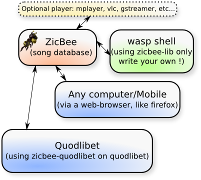

.. ZicBee documentation master file, created by
   sphinx-quickstart on Sun Dec 13 18:59:23 2009.
   You can adapt this file completely to your liking, but it should at least
   contain the root `toctree` directive.

=================
Welcome to ZicBee
=================

**0.9-RC8** is out, changelog from *rc7*:

* Some fixes on pattern parser
* Re-add ``auto:`` keyword
* Fix install from zip and setuptools compatibility

What is it ?
************

Zicbee is an alternative to mpd on steroids written in pure python.
It's specially designed for people with huge playlists collection needing a fast lookup over the whole database.
By design, it will never interrupt the current song, you have to use "next" or "prev" to do that, or just wait the end :)

Each component of this graph except the dotted borders one can be on a separate computer.
The optional player feature is linked to zicdb server (the sound will be produced by this one, unless you are using m3u format or quodlibet plugin).

The whole pack containing every player backend, the server and the shell plus all the dependencies, is **less than 600k** !
Just unpack the zip file and execute the project, no install needed.

Contact
*******

Email
-----

Use my email for bugreport, urgent requests, support, or anything.
My contact is fdev31 <AT> gmail <DOT> com.

Bug reporting
-------------

Use the `Bugtracker`_ , don't try to create an account, just report it anonymously.

Documentation
*************

.. toctree::
    :maxdepth: 1

    intro
    user_manual
    changelog
    roadmap

.. todolist::

Developers Corner
*****************
.. toctree::
    :maxdepth: 1

    dev_intro
    api_reference

* :ref:`API Index <genindex>`
* :ref:`modindex`
* :ref:`search`

Browsing sources
****************

See the `sources repository <http://zicbee.gnux.info/hg/>`_

.. _Bugtracker: http://zicbee.gnux.info/bugtraq

